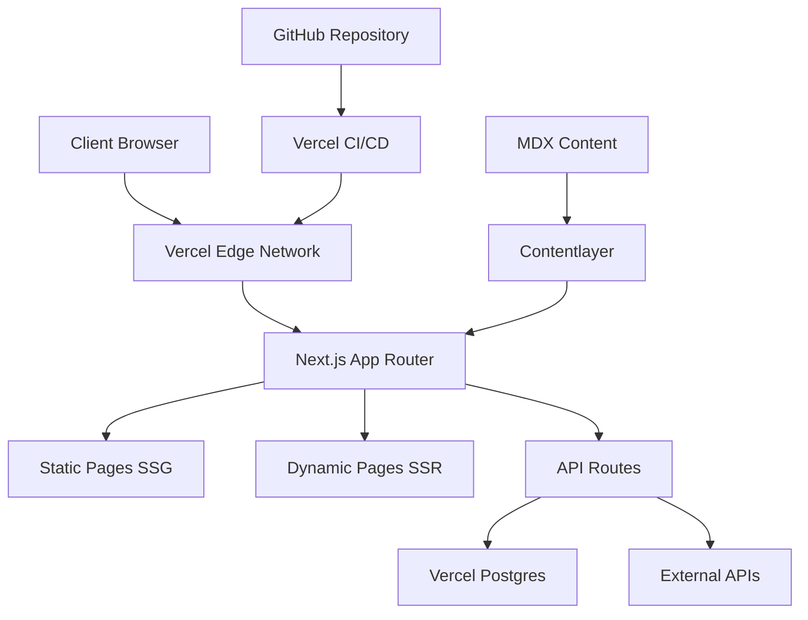

# Portfolio Website Design Document

## Overview

This design document outlines the architecture and implementation approach for a production-ready portfolio website built with Next.js 14+ (App Router), showcasing advanced frontend skills while maintaining excellent performance and accessibility. The design emphasizes visual excellence through modern CSS techniques, comprehensive project showcases, and seamless content management.

## Architecture

### Technology Stack

**Frontend Framework:** Next.js 14+ with App Router

- **Justification:** SSR/SSG capabilities, excellent performance, built-in optimizations, and mature ecosystem
- **Rendering Strategy:** Hybrid approach using SSG for static content (projects, about) and SSR for dynamic content (blog, contact forms)

**Styling Approach:** CSS Modules + Tailwind CSS

- **Justification:** CSS Modules provide scoped styles and component isolation, while Tailwind offers utility-first rapid development and consistent design tokens
- **Custom CSS:** Advanced animations and complex layouts will use CSS Modules with CSS custom properties

**Content Management:** MDX + Contentlayer

- **Justification:** Type-safe content management, Git-based workflow, excellent developer experience, and no external dependencies
- **Alternative:** Sanity CMS for non-technical content updates (Phase 2)

**Backend API:** Next.js API Routes + Vercel Functions

- **Justification:** Serverless architecture, automatic scaling, integrated with frontend deployment

**Database:** Vercel Postgres (Neon) + Prisma ORM

- **Justification:** Serverless database, excellent Next.js integration, type-safe queries

**Deployment:** Vercel

- **Justification:** Seamless Next.js integration, automatic deployments, edge functions, analytics

### System Architecture



## Components and Interfaces

### Design System Foundation

**Color System:**

```css
:root {
  /* Primary Brand Colors */
  --color-primary-50: #f0f9ff;
  --color-primary-500: #3b82f6;
  --color-primary-900: #1e3a8a;

  /* Neutral Grays */
  --color-gray-50: #f9fafb;
  --color-gray-900: #111827;

  /* Semantic Colors */
  --color-success: #10b981;
  --color-warning: #f59e0b;
  --color-error: #ef4444;

  /* Gradients */
  --gradient-primary: linear-gradient(
    135deg,
    var(--color-primary-500) 0%,
    var(--color-primary-700) 100%
  );
  --gradient-hero: linear-gradient(135deg, #667eea 0%, #764ba2 100%);
}
```

**Typography Scale:**

```css
:root {
  /* Font Families */
  --font-sans: 'Inter', system-ui, sans-serif;
  --font-mono: 'JetBrains Mono', 'Fira Code', monospace;

  /* Fluid Typography */
  --text-xs: clamp(0.75rem, 0.7rem + 0.25vw, 0.875rem);
  --text-sm: clamp(0.875rem, 0.8rem + 0.375vw, 1rem);
  --text-base: clamp(1rem, 0.9rem + 0.5vw, 1.125rem);
  --text-lg: clamp(1.125rem, 1rem + 0.625vw, 1.25rem);
  --text-xl: clamp(1.25rem, 1.1rem + 0.75vw, 1.5rem);
  --text-2xl: clamp(1.5rem, 1.3rem + 1vw, 2rem);
  --text-3xl: clamp(1.875rem, 1.6rem + 1.375vw, 2.5rem);
  --text-4xl: clamp(2.25rem, 1.9rem + 1.75vw, 3.5rem);
}
```

**Spacing System:**

```css
:root {
  --space-1: 0.25rem; /* 4px */
  --space-2: 0.5rem; /* 8px */
  --space-4: 1rem; /* 16px */
  --space-6: 1.5rem; /* 24px */
  --space-8: 2rem; /* 32px */
  --space-12: 3rem; /* 48px */
  --space-16: 4rem; /* 64px */
  --space-24: 6rem; /* 96px */
}
```

### Core Components

#### 1. Hero Section Component

```typescript
interface HeroProps {
  title: string
  subtitle: string
  ctaText: string
  ctaHref: string
  backgroundImage?: string
}

// Advanced CSS Features:
// - Parallax scrolling effect
// - Animated gradient backgrounds
// - Staggered text animations
// - Floating particle system
```

#### 2. Project Card Component

```typescript
interface ProjectCardProps {
  id: string
  title: string
  description: string
  image: string
  techStack: string[]
  liveUrl?: string
  githubUrl?: string
  featured?: boolean
}

// Advanced CSS Features:
// - 3D hover transformations
// - Glassmorphism card design
// - Dynamic tech stack badges
// - Smooth image overlays
```

#### 3. Case Study Template

```typescript
interface CaseStudyProps {
  project: {
    title: string
    overview: string
    role: string
    timeline: string
    techStack: string[]
    architecture: string // Mermaid diagram
    challenges: Challenge[]
    solutions: Solution[]
    codeSnippets: CodeSnippet[]
    metrics: Metric[]
    liveUrl?: string
    githubUrl?: string
  }
}
```

#### 4. Navigation Component

```typescript
interface NavigationProps {
  items: NavItem[]
  currentPath: string
  theme: 'light' | 'dark'
}

// Advanced CSS Features:
// - Morphing hamburger menu
// - Backdrop blur effects
// - Smooth scroll indicators
// - Active state animations
```

#### 5. Certifications Timeline

```typescript
interface CertificationTimelineProps {
  certifications: Certification[]
  layout: 'timeline' | 'grid'
}

interface Certification {
  id: string
  title: string
  issuer: string
  date: string
  credentialUrl?: string
  badgeImage?: string
}
```

### Advanced CSS Recipes

#### 1. Gradient System

```css
.gradient-mesh {
  background:
    radial-gradient(
      circle at 20% 80%,
      rgba(120, 119, 198, 0.3) 0%,
      transparent 50%
    ),
    radial-gradient(
      circle at 80% 20%,
      rgba(255, 119, 198, 0.3) 0%,
      transparent 50%
    ),
    radial-gradient(
      circle at 40% 40%,
      rgba(120, 219, 255, 0.3) 0%,
      transparent 50%
    );
}

.glass-card {
  background: rgba(255, 255, 255, 0.1);
  backdrop-filter: blur(10px);
  border: 1px solid rgba(255, 255, 255, 0.2);
  box-shadow:
    0 8px 32px rgba(0, 0, 0, 0.1),
    inset 0 1px 0 rgba(255, 255, 255, 0.2);
}
```

#### 2. Layered Shadow System

```css
.shadow-soft {
  box-shadow:
    0 1px 3px rgba(0, 0, 0, 0.12),
    0 1px 2px rgba(0, 0, 0, 0.24);
}

.shadow-medium {
  box-shadow:
    0 4px 6px rgba(0, 0, 0, 0.07),
    0 2px 4px rgba(0, 0, 0, 0.06),
    0 1px 2px rgba(0, 0, 0, 0.05);
}

.shadow-dramatic {
  box-shadow:
    0 25px 50px -12px rgba(0, 0, 0, 0.25),
    0 10px 20px -5px rgba(0, 0, 0, 0.1);
}
```

#### 3. Complex Animations

```css
@keyframes float {
  0%,
  100% {
    transform: translateY(0px) rotate(0deg);
  }
  33% {
    transform: translateY(-10px) rotate(1deg);
  }
  66% {
    transform: translateY(5px) rotate(-1deg);
  }
}

@keyframes slideInStagger {
  from {
    opacity: 0;
    transform: translateY(30px);
  }
  to {
    opacity: 1;
    transform: translateY(0);
  }
}

.stagger-animation > * {
  animation: slideInStagger 0.6s ease-out forwards;
}

.stagger-animation > *:nth-child(1) {
  animation-delay: 0.1s;
}
.stagger-animation > *:nth-child(2) {
  animation-delay: 0.2s;
}
.stagger-animation > *:nth-child(3) {
  animation-delay: 0.3s;
}
```

## Data Models

### Project Schema

```typescript
interface Project {
  id: string
  slug: string
  title: string
  description: string
  longDescription: string
  image: string
  gallery: string[]
  techStack: TechStack[]
  category: ProjectCategory
  featured: boolean
  status: 'completed' | 'in-progress' | 'archived'
  startDate: Date
  endDate?: Date
  liveUrl?: string
  githubUrl?: string
  caseStudy?: CaseStudy
  createdAt: Date
  updatedAt: Date
}

interface CaseStudy {
  overview: string
  role: string
  timeline: string
  problem: string
  solution: string
  architecture: string // Mermaid diagram code
  challenges: Challenge[]
  keyFeatures: Feature[]
  codeSnippets: CodeSnippet[]
  metrics: Metric[]
  learnings: string[]
}
```

### Content Management Schema

```typescript
// MDX Frontmatter for Projects
interface ProjectFrontmatter {
  title: string
  description: string
  image: string
  techStack: string[]
  category: string
  featured: boolean
  liveUrl?: string
  githubUrl?: string
  publishedAt: string
}

// Blog Post Schema
interface BlogPost {
  slug: string
  title: string
  excerpt: string
  content: string
  image?: string
  tags: string[]
  publishedAt: Date
  readingTime: number
  featured: boolean
}
```

## Error Handling

### Client-Side Error Boundaries

```typescript
// Global Error Boundary
class GlobalErrorBoundary extends React.Component {
  // Catches JavaScript errors, displays fallback UI
  // Integrates with error tracking service
}

// Page-Level Error Handling
// Custom 404 and 500 pages with navigation
// Graceful degradation for failed API calls
```

### API Error Handling

```typescript
// Standardized API Error Response
interface ApiError {
  code: string
  message: string
  details?: Record<string, any>
  timestamp: string
}

// Error Middleware for API Routes
// Rate limiting and validation errors
// Database connection error handling
```

## Testing Strategy

### Unit Testing

- **Framework:** Jest + React Testing Library
- **Coverage:** Components, utilities, API routes
- **Focus:** Component behavior, accessibility, edge cases

### Integration Testing

- **Framework:** Playwright
- **Coverage:** User flows, form submissions, navigation
- **Focus:** Cross-browser compatibility, responsive design

### Performance Testing

- **Tools:** Lighthouse CI, Web Vitals monitoring
- **Metrics:** Core Web Vitals, bundle size analysis
- **Automation:** CI/CD pipeline integration

### Accessibility Testing

- **Tools:** axe-core, WAVE, manual keyboard testing
- **Coverage:** WCAG AA compliance, screen reader compatibility
- **Automation:** Automated a11y tests in CI pipeline

## Performance Optimization

### Image Optimization

```typescript
// Next.js Image component with optimization
import Image from 'next/image'

// Responsive images with multiple formats
// Lazy loading with intersection observer
// WebP/AVIF format support
```

### Code Splitting Strategy

```typescript
// Route-based code splitting (automatic with App Router)
// Component-based lazy loading
const ProjectModal = lazy(() => import('./ProjectModal'))

// Bundle analysis and optimization
// Tree shaking for unused code
```

### Caching Strategy

```typescript
// Static Generation for content pages
export const revalidate = 3600 // ISR every hour

// API route caching
export const runtime = 'edge'
export const dynamic = 'force-static'
```

## SEO and Meta Data

### Structured Data

```json
{
  "@context": "https://schema.org",
  "@type": "Person",
  "name": "Tshegofatso Godfrey Moses",
  "jobTitle": "Full-Stack Software Developer & UI/UX Designer",
  "url": "https://portfolio-domain.com",
  "sameAs": ["https://linkedin.com/in/profile", "https://github.com/username"]
}
```

### Meta Tags Template

```typescript
// Dynamic meta tags for each page
export const metadata: Metadata = {
  title: 'Page Title | Tshegofatso Moses',
  description: 'Page description...',
  openGraph: {
    title: 'Page Title',
    description: 'Page description...',
    images: ['/og-image.jpg'],
  },
  twitter: {
    card: 'summary_large_image',
  },
}
```

This design provides a comprehensive foundation for building a production-ready portfolio that meets all the specified requirements while maintaining excellent performance, accessibility, and visual appeal.
